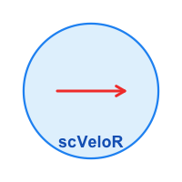

# scVeloR 

## RNA Velocity Analysis for Single-Cell Transcriptomics in R

📚 **Documentation**: <https://zaoqu-liu.github.io/scVeloR/>

<!-- badges: start -->
[](https://zaoqu-liu.r-universe.dev/scVeloR)
[](https://github.com/Zaoqu-Liu/scVeloR/actions)
[](https://opensource.org/licenses/MIT)
[](https://CRAN.R-project.org/package=scVeloR)
<!-- badges: end -->

## Introduction

**scVeloR** is a comprehensive R implementation of RNA velocity analysis, providing a native R solution for inferring cellular dynamics from single-cell RNA sequencing data. The package implements the computational framework originally described in [Bergen et al., *Nature Biotechnology* (2020)](https://doi.org/10.1038/s41587-020-0591-3), enabling researchers to estimate RNA velocities and predict future cell states directly within the R/Bioconductor ecosystem.

RNA velocity leverages the distinction between nascent (unspliced) and mature (spliced) mRNA to model the time derivative of gene expression, providing insights into:

- **Cellular differentiation trajectories**
- **Transcriptional dynamics during development**
- **Cell fate decisions and lineage commitment**
- **Transient cell states in dynamic processes**

## Features

- **Multiple velocity models**: Deterministic (steady-state), stochastic, and dynamical models
- **High-performance implementation**: C++ acceleration via Rcpp/RcppArmadillo for computationally intensive operations
- **Seurat integration**: Native support for Seurat V4 and V5 objects
- **Cross-platform compatibility**: Windows, macOS, and Linux support
- **Comprehensive visualization**: Velocity embeddings, streamlines, phase portraits, and heatmaps
- **Latent time inference**: Gene-shared latent time estimation for trajectory analysis

## Installation

### From R-universe (Recommended)

```r
install.packages("scVeloR", repos = "https://zaoqu-liu.r-universe.dev")
```

### From GitHub

```r
# Install devtools if not available
if (!requireNamespace("devtools", quietly = TRUE))
    install.packages("devtools")

devtools::install_github("Zaoqu-Liu/scVeloR")
```

### System Requirements

- R (≥ 4.0.0)
- C++ compiler with C++11 support
- Seurat (≥ 4.0.0) for Seurat object integration

## Quick Start

```r
library(scVeloR)
library(Seurat)

# Load Seurat object with spliced/unspliced layers
# seurat_obj <- readRDS("your_data.rds")

# Run velocity analysis pipeline
seurat_obj <- run_velocity(
  seurat_obj, 
  mode = "dynamical",
  embedding = "umap"
)

# Visualize velocity field
plot_velocity(seurat_obj, embedding = "umap")
```

## Methodology

### Mathematical Framework

scVeloR models the kinetics of mRNA synthesis and degradation using the following system of ordinary differential equations:

$$\frac{du}{dt} = \alpha(t) - \beta u$$

$$\frac{ds}{dt} = \beta u - \gamma s$$

where:
- $u$: unspliced mRNA abundance
- $s$: spliced mRNA abundance  
- $\alpha$: transcription rate
- $\beta$: splicing rate
- $\gamma$: degradation rate

### Velocity Models

| Model | Description | Use Case |
|-------|-------------|----------|
| **Deterministic** | Assumes steady-state equilibrium ($du/dt \approx 0$) | Large datasets, initial exploration |
| **Stochastic** | Incorporates second-order moments for transcriptional noise | Noisy data, transcriptional bursting |
| **Dynamical** | Full kinetics inference via EM algorithm | High-resolution dynamics, transient states |

### Analytical Solutions

For constant transcription rate $\alpha$, the analytical solutions are:

**Unspliced:**
$$u(t) = u_0 e^{-\beta t} + \frac{\alpha}{\beta}(1 - e^{-\beta t})$$

**Spliced:**
$$s(t) = s_0 e^{-\gamma t} + \frac{\alpha}{\gamma}(1 - e^{-\gamma t}) + \frac{\alpha - u_0 \beta}{\gamma - \beta}(e^{-\gamma t} - e^{-\beta t})$$

## Detailed Usage

### Step-by-Step Analysis

```r
# 1. Data preparation and preprocessing
seurat_obj <- prepare_velocity(seurat_obj, n_neighbors = 30)

# 2. Velocity estimation
seurat_obj <- velocity(seurat_obj, mode = "dynamical", max_iter = 10)

# 3. Velocity graph construction
seurat_obj <- velocity_graph(seurat_obj)

# 4. Embedding projection
seurat_obj <- velocity_embedding(seurat_obj, embedding_name = "umap")

# 5. Latent time computation (dynamical model)
seurat_obj <- compute_latent_time(seurat_obj)
```

### Visualization

```r
# Velocity arrows on embedding
plot_velocity(seurat_obj, color_by = "seurat_clusters", arrow_scale = 1)

# Velocity streamlines
plot_velocity_stream(seurat_obj, density = 1)

# Phase portrait for specific gene
plot_phase(seurat_obj, gene = "Sox2", show_fit = TRUE)
```

### Gene Ranking

```r
# Rank genes by velocity model fit
top_genes <- rank_velocity_genes(seurat_obj, n_top = 100)
head(top_genes)
```

## Data Requirements

Input data should be a Seurat object containing:

1. **Spliced counts**: Layer named `"spliced"` or `"Spliced"`
2. **Unspliced counts**: Layer named `"unspliced"` or `"Unspliced"`
3. **Dimensionality reduction**: UMAP or t-SNE coordinates for visualization

### Data Import

```r
# From loom file (velocyto output)
library(SeuratDisk)
seurat_obj <- LoadLoom("velocyto_output.loom")

# From AnnData h5ad file
seurat_obj <- import_from_anndata("scanpy_output.h5ad")
```

## Output Structure

Results are stored in `seurat_obj@misc$scVeloR`:

| Component | Description |
|-----------|-------------|
| `velocity` | Velocity matrix and model parameters |
| `dynamics` | Inferred kinetic parameters (dynamical model) |
| `velocity_graph` | Cell-cell transition probabilities |
| `velocity_embedding` | Projected velocity vectors |

Cell-level metadata in `seurat_obj@meta.data`:

| Variable | Description |
|----------|-------------|
| `latent_time` | Gene-shared latent time |
| `velocity_pseudotime` | Diffusion-based pseudotime |
| `velocity_confidence` | Velocity confidence score |
| `velocity_coherence` | Local velocity coherence |

## Performance

scVeloR employs several optimization strategies:

- **Vectorized R operations**: Efficient matrix computations using the Matrix package
- **C++ acceleration**: Core algorithms implemented in C++ via Rcpp/RcppArmadillo
- **Sparse matrix support**: Memory-efficient handling of large single-cell datasets
- **Parallel processing**: Optional parallelization for neighbor computation

## Citation

If you use scVeloR in your research, please cite:

```bibtex
@software{scVeloR2024,
  author = {Liu, Zaoqu},
  title = {{scVeloR}: {RNA} Velocity Analysis in {R}},
  url = {https://github.com/Zaoqu-Liu/scVeloR},
  year = {2024},
  note = {R package}
}
```

Please also cite the original scVelo methodology:

```bibtex
@article{Bergen2020,
  title = {Generalizing {RNA} velocity to transient cell states through dynamical modeling},
  author = {Bergen, Volker and Lange, Marius and Peidli, Stefan and Wolf, F. Alexander and Theis, Fabian J.},
  journal = {Nature Biotechnology},
  volume = {38},
  pages = {1408--1414},
  year = {2020},
  doi = {10.1038/s41587-020-0591-3}
}
```

## Related Resources

- [scvelo](https://github.com/theislab/scvelo) - Original Python implementation
- [velocyto](http://velocyto.org/) - RNA velocity estimation from BAM files
- [Seurat](https://satijalab.org/seurat/) - R toolkit for single-cell genomics

## Contributing

Contributions are welcome. Please submit issues or pull requests on [GitHub](https://github.com/Zaoqu-Liu/scVeloR).

## License

This project is licensed under the MIT License - see the [LICENSE](LICENSE) file for details.

## Acknowledgments

This package is based on the computational framework developed by the [Theis Lab](https://www.helmholtz-munich.de/icb/research/groups/theis-lab/overview/index.html) and implements algorithms described in their scVelo software.
